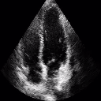

# Echo-FRUC:
### A Neural Network for Frame Rate Up-Conversion (FRUC) in of Cardiac Echo

*Example FRUC of three a cardiac cine.*

down-sampled ground truth (input)
Ground truth video &nbsp; &nbsp; &nbsp; &nbsp; &nbsp; &nbsp; &nbsp; &nbsp; &nbsp; &nbsp; &nbsp; &nbsp; &nbsp; &nbsp;                 |  down-sampled ground truth (input)
:-------------------------------------------------:|:------------------------------------------------:
                        |  

VAE-only output &nbsp; &nbsp; &nbsp; &nbsp; &nbsp; &nbsp; &nbsp; &nbsp; &nbsp; &nbsp; &nbsp; &nbsp; &nbsp; &nbsp;  &nbsp;    &nbsp;                                 |  Proposed method  output ; &nbsp; &nbsp; &nbsp; &nbsp; &nbsp;&nbsp; &nbsp; &nbsp; &nbsp
:-------------------------------------------------:|:------------------------------------------------:
                        |  
